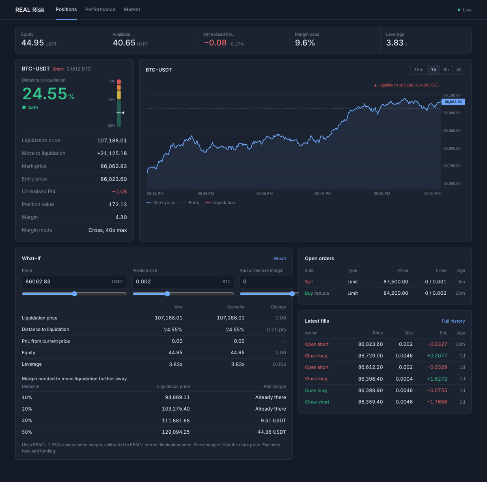
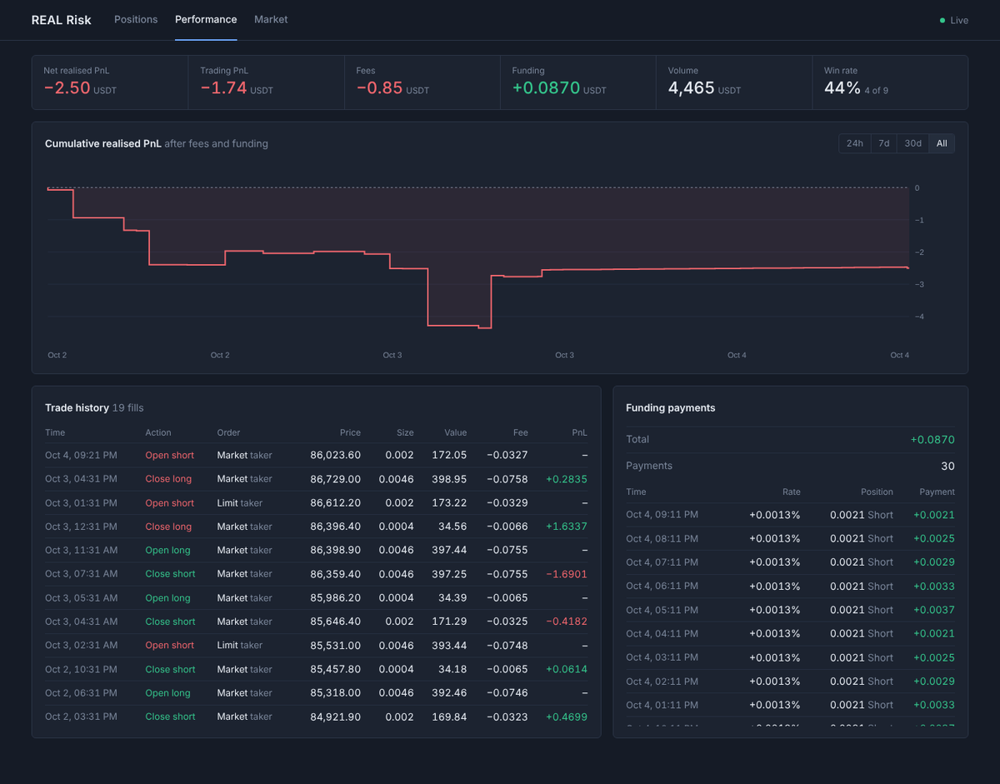
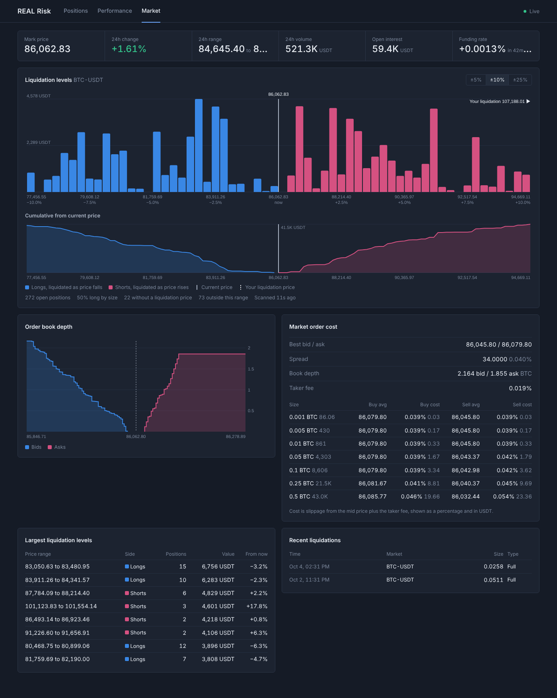

# REAL Risk

A free, open-source risk dashboard for traders on the [REAL](https://real.xyz) perpetuals DEX on IOTA. It shows how close your positions are to liquidation, lets you test "what if" scenarios before you act, tracks your trading performance, and maps where other traders' liquidations sit across the market.

> **Unofficial community tool.** Not made by, affiliated with or endorsed by the REAL team. Use at your own risk and double-check anything important on REAL itself.



## Is it safe?

- **Read-only.** It only reads REAL's public data API. It can't place orders, move funds or touch your wallet.
- **No private key.** It only needs your public Account ID. Never paste your seed phrase or private key into this or any other tool.
- **Runs on your computer.** The dashboard is served from your own machine at `127.0.0.1` and can't be opened by anyone else. Nothing is sent anywhere except requests to REAL's API (and Google Fonts for the typeface).
- **Small and readable.** Two Python files and one HTML page, using only Python's standard library. Read them before you run them.

## What's in it

**Positions**
- Equity, available balance, unrealised PnL, margin used and leverage.
- Distance to liquidation, with a risk gauge, liquidation price, the price move needed to get there, entry, margin and mode.
- Live price chart with your entry and liquidation price.
- **What-if calculator.** Change the price, your position size or your margin and instantly see the new liquidation price, distance, equity and leverage. It also shows how much margin you'd need to push your liquidation price 10%, 20%, 30% or 50% away.
- Open orders and latest fills.

**Performance**
- Net realised PnL, trading PnL, fees, funding, volume and win rate.
- Cumulative realised PnL chart, full trade history and funding payments.



**Market**
- Mark price, 24h change, range and volume, open interest, funding rate and countdown to the next funding.
- **Liquidation map.** Every minute it scans all open positions on REAL and shows how much would be force-closed at each price level, plus a running total as price moves away. Your own liquidation price is marked on it. Only totals are shown; no account is identified.
- Order book depth, and what a market order of a given size would cost you in slippage plus fees.
- Largest liquidation levels and recent liquidations.



*Screenshots use example data.*

## Get started

You need **Python 3.9 or newer**. Check with `python --version` (Windows) or `python3 --version` (Mac/Linux). If you don't have it, install it from [python.org](https://www.python.org/downloads/). On Windows, tick **Add Python to PATH** during install.

1. On this page, click **Code**, then **Download ZIP**, and unzip it.
2. Start the dashboard:
   - **Windows:** open the unzipped folder and double-click `start-dashboard.bat`.
   - **Mac/Linux:** open a terminal in the folder and run `python3 dashboard.py`.
3. Paste your **Account ID** when asked. Find it on REAL under **Settings → Account → Account ID** (not your wallet address). It's saved in `config.json` so you're only asked once.
4. Your browser opens the dashboard at http://127.0.0.1:8787. Keep the black window open while you use it; closing it stops the dashboard.

To watch more than one account, or switch to testnet, see [Configuration](#configuration).

## How the numbers work

- **Distance to liquidation** is how far the mark price must move against you to reach REAL's estimated liquidation price: `(mark − liq) / mark` for a long, `(liq − mark) / mark` for a short.
- **What-if** uses the standard perpetuals condition for liquidation, collateral plus PnL equals maintenance margin, with REAL's published maintenance margin rate. It's calibrated so that, with nothing changed, it reproduces REAL's own liquidation price. Size changes are assumed to fill at the mark price, and fees and funding aren't included. For cross margin, other positions on the account are held constant.
- **Liquidation map** values each position at its size times its liquidation price. Liquidation prices are REAL's estimates and move as traders add margin, trade or get funded, so treat the map as a snapshot.
- **Market order cost** walks the current order book and adds the taker fee. The book can change before your order arrives.

## Alerts (optional)

`real_risk_monitor.py` is a separate background monitor that warns you as a position approaches liquidation, in the terminal and optionally in Discord. The dashboard doesn't send alerts itself, so run this alongside it if you want them.

| Event | Default | Discord ping |
|---|---|---|
| Warning: within 15% of liquidation | once | no |
| Danger: within 8% | repeats every 30 min | yes |
| Critical: within 4% | repeats every 5 min | yes |
| Back to a safer level | once | no |
| Liquidation recorded on your account | once | yes |
| Position opened, closed or flipped | once | no |
| Can't reach the API for 3+ minutes | once | yes |

```
python3 real_risk_monitor.py --account 0xYOUR_ACCOUNT_ID --once     # check it works
python3 real_risk_monitor.py --config config.json                    # run it
python3 real_risk_monitor.py --config config.json --test-alert       # test Discord
```

**Discord setup:** in a server you own, go to **Server Settings → Integrations → Webhooks → New Webhook**, pick a channel and **Copy Webhook URL**. Put it in `config.json` as `discord_webhook_url` (or set the `REAL_DISCORD_WEBHOOK` environment variable). Treat the URL like a password. To be @mentioned on serious alerts, turn on Developer Mode in Discord, right-click your name, **Copy User ID**, and set `"mention": "<@YOUR_USER_ID>"`.

An alert only helps if the monitor is running when price moves. A laptop that goes to sleep won't do; a small always-on machine or a cheap VPS (run it in `tmux` or as a `systemd` service) will. It's an early warning, not a stop-loss, so use stop orders on REAL too.

## Configuration

Copy `config.example.json` to `config.json` and edit it. Every key is optional except `accounts`.

| Key | Default | Meaning |
|---|---|---|
| `network` | `mainnet` | `mainnet` or `testnet` |
| `accounts` | | List of `"0x..."` IDs or `{"id": "0x...", "label": "Name"}` |
| `poll_seconds` | `15` | How often to refresh (minimum 5; REAL's API is rate limited) |
| `thresholds_pct` | `15 / 8 / 4` | Warning, danger and critical distance to liquidation, in % |
| `discord_webhook_url` | | Discord webhook for alerts |
| `mention` | | Who to ping on serious alerts |
| `repeat_minutes` | `0 / 30 / 5` | Re-alert interval while a position stays in a level |
| `recovery_buffer_pct` | `1.0` | How far a position must recover past a level before it's downgraded |
| `notify_position_changes` | `true` | Alerts for opened, closed or flipped positions |
| `api_down_alert_minutes` | `3` | Alert if the API is unreachable this long |

## Troubleshooting

- **"python is not recognised"**: Python isn't installed or wasn't added to PATH. Reinstall it with **Add Python to PATH** ticked, or try `py dashboard.py`.
- **"can't open file"**: you're in the wrong folder. Windows sometimes unzips into a folder inside a folder; go one level deeper.
- **"Port 8787 is busy"**: the dashboard is already running in another window, or run `python dashboard.py --port 8788`.
- **"Reconnecting" in the top right**: REAL's API is unreachable or rate-limiting you. It retries automatically. If it keeps happening, raise `poll_seconds` in `config.json`.
- **Liquidation map says "Scanning"**: the first scan takes up to a minute after starting.

## For developers

```
python3 -m unittest -v
```

Tests run offline using response shapes captured from REAL's mainnet API. Data comes from REAL's public indexer (`https://indexer.api.real.xyz`); the official Rust SDK at [realmarkets/rust-sdk](https://github.com/realmarkets/rust-sdk) documents the endpoints.

Issues and pull requests are welcome.

## License

MIT. See [LICENSE](LICENSE).
